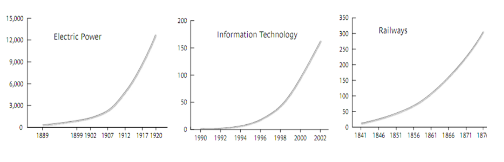

#### 목표
*   소프트웨어 바탕 경력 진로
*   IT 일반 상품화 (IT Commoditization)
*   소프트웨어 제품과 서비스 그리고 클라우드
   

### 소프트웨어 바탕 경력 진로

소프트웨어를 가지고 할 수 있는 경로는 다른 직업도 마찬가지지만 크게 세가지로 나눌 수 있다.  

삼성이나 현대도 처음 시작할 때를 생각하면 한국전쟁 후에 스타트업(Startup)이라고 볼 수 있다. 요즘은 흔히 스타트업하면 페이스북, 구글, 아마존 등을 연상하지만 하나 같이 매우 적은 인원으로 시작하여 짧은 기간에 사람들이 살아가는 방식에 많은 변화를 주었다.  

다른 진로는 자영업(Small Business)자와 마찬가지로 오랜시간 동안 특정 분야에 소프트웨어 제품과 서비스를 제공하고 한정된 고객을 기반으로 하는 전통적인 의미로 재래시장이나 중소기업 대표님들을 만나볼 수 있다.

정부, 학교, 대기업, 중소기업의 소프트웨어 전문 직업을 가지고 연봉을 기반으로 매월 일정한 급여를 받고 지식노동을 서비스로 제공하는 직장인 경로가 있다.  

소프트웨어를 컴퓨터를 통해서 처음 접하고 학습하는 것과는 별개로 다양한 직업경로를 선택하게 된다. 상기 세가지 직업 경로는 소프트웨어 정보기술을 통해서 사회에 일정한 부가가치를 만들어내는 생산자로서 역할에 방점을 두었다. 하지만, 설사 소프트웨어를 직업으로 가지는 것과는 별개로 누구나 소프트웨어를 소비하면서 살아가게 된다.  

다들 인지하고 있는지는 모르지만, 소프트웨어를 소비하는 방식은 크게 세가지가 있다.

- 임베디드 소프트웨어 (Embedded Software)
- 소프트웨어 제품 (Software Product)
- IT 서비스 (IT Service)

많은 사람들이 스마트폰, 자동차, 청소기, 냉장고 등 다양한 전자제품을 소비하면서 그 속에 내장된 소프트웨어(**임베디드 소프트웨어**)도 함께 소비하게된다. 물론 그 비중이 과거에는 작아 인지를 못하고 일부 전문가의 전유물이었지만, 점차 소프트웨어 비중이 높아지면서 전화기, 자동차, 냉장고, 청소기, 키오스크, 전동차, 비행기, 금융, 보안, 날씨 등등 거의 모든 제품과 서비스에 소프트웨어가 내장되어 **소프트웨어** 자체를 소비하다고 해도 과언이 아닌 시대가 되었다.  

마이크로소프트, 오라클, SAP 같은 기라성 같은 회사가 모두 소프트웨어 프로덕트를 판매해서 사업을 영위하면서 큰 성공을 거두고 있다. 지금은 **소프트웨어 제품(Software Product)**의 시대도 상대적으로 저물어가는 것으로 보인다. 그렇다고 그 사업이 없어지는 것은 아니고, 융합 소프트웨어의 출현으로 기존 소프트웨어 제품을 중심으로 소프트웨어 제조를 핵심사업으로 하고 있던 회사들이 변방으로 밀려나 보인다. 

> 융합 소프트웨어 사업은 하드웨어나 기타 다른 분야와 융합되는 것과는 
> 별도로 소프트웨어 자체가 소프트웨어 제품과 서비스를 동시에 개발하여 고객에게 
> 제공되는 것을 지칭한다. 

**IT서비스**는 대한민국 전자정부, 제조업체 ERP 시스템, 주문형 홈페이지 등등 그 종류가 너무 많다. 소프트웨어 개발이 과거에 비해서 진입장벽이 많이 낮아져서 누구나 소프트웨어를 개발할 수 있는 세상이 된 것은 분명하다. 하지만, 여전히 상업적인 혹은 보안, 안전, 국방 등 다양한 분야에 주문형으로 제작될 수 있는 소프트웨어를 누군가는 필요로 하기 때문에 이러한 소프트웨어를 개발할 수 있는 IT 서비스 분야는 있게 된다. 사실 이런 사업모델로 부를 축적한 유명한 사람은 EDS의 창업주 로스페로는 미국 대통령 후보로 나왔을 정도이니 엄청난 산업임에는 분명하고, 향후에도 계속 그 추세를 이어갈 것으로 생각된다.

이렇듯, 소프트웨어를 생산하는 위치에서 직업으로 바라볼 경우 세가지 분야가 존재한다. 현재를 살고 있는 지구상의 누구도 소프트웨어를 한시도 소비하지 않고 살수 있는 세상에 살고 있다고 생각하니 소프트웨어가 시나브로 우리 삶에 스며들어 공기나, 물과 같이 없어서는 안 될 중요한 존재가 된 것은 부정할 수 없는 사실이다.

### IT 일반 상품화 (IT Commoditization)

니콜라스 카 (Nicholas Carr)는 2003년 하버드 비즈니스 리뷰에 "IT Dosen’t Matter" 논문에서 IT 기술이 경쟁 우위를 가지는 기술로서 의미가 없어졌다고 주장했다. IT 기술은 이미 유틸리티 사업과 마찬가지로 독보적인 기술우위나 새로운 산업의 초기에서 보여지는 특징이 없어졌다고 한다. 특히 인프라 기술이 가지고 있는 4가지 특징을 IT 일반상품화 현상에서 찾을 수 있다.

- **표준화**: 표준화와 동질화가 IT 기술의 발달과정에서 관찰
- **높은 복제성**: 자료의 디지털 복제
- **전달의 용이성**: 인터넷 채널을 통한 손쉬운 정보의 전달
- **급격한 가격의 하락**: 무어의 법칙(Moore's Law)

인프라 기술의 가장 큰 특징은 설치 속도에서 있다. 아래의 사례는 철도나 전기 발전소의 사례와 마찬가지로 IT 기술에서 인터넷에 연결되는 호스트 컴퓨터 수와 동일한 흐름을 보인다. 대규모의 투자로 용량이 급격히 늘어나고 이는 가격 인하로 일반상품화 흐름을 나타내게 된다.

- 그림 (좌측). U.S. electric utility generating capacity, in megawatts
- 그림 (중간). Number of host computers on the internet (in millions)
- 그림 (우측). Railroad track worldwide in thousands of kilometers

IT기술에서 전략적인 우월성을 갖는 기회가 점점 더 줄어 들어감에 따라 IT 의사결정권자들은 다음의 3가지 가이드라인을 따르는 것을 니콜라스 카는 제안한다.

- **IT 비용을 줄여라 (Spend Less)**: IT 투자를 통해서 전략적인 우위를 가져가는 것이 힘들어 짐에 따라 대규모 IT 투자는 투자대비 효과를 장담하기 힘들다.
- **앞서지 말고, 시대의 흐름을 따라간다 (Follow, Don't lead)**: 무어의 법칙(Moore's Law)은 IT 투자나 구매를 늦출수록 더욱 많은 수익이 고객에게 돌아가게 된다. 추가로 기술의 급격한 변경에 따른 불용비융을 줄일 수 있고, 기술적으로 낮은 완성도에 따른 품질 비용도 줄일 수 있다.
- **기회보다 취약점 보완에 신경써라 (Focus on vulnerabilities, not opportunities)**: 성숙된 IT 인프라에서 전략적인 경쟁력을 찾기가 어려워지고 점점더 많은 IT기술의 부문이 외주화됨에 따라 기술적인 불일치, 서비스 중단, 보완 등 관심을 취약점 보완에 두어야 한다.  

전략적인 목표달성을 위해서 웨일(Weill & Aral)은 2006년 IT 투자를 통해서 높은 수익을 올릴 수 있는 방법을 제시하였다. IT 투자 분야를 크게 4가지 분야(인프라, 정보처리, 분석 및 전략)로 나누어 각 분야별 추진사례 및 방법을 제시하였다.

- **인프라**: 여러 응용프로그램을 위한 Shared IT Service
- **정보처리**: 동일한 비용으로 정보처리 건수를 늘려 비용 절감
- **분석**: 회계, 보고서, 통계분석 등 특정 목적을 위한 분석 서비스
- **전략**: 신규 시장진입 및 신제품/서비스 개발을 위한 전략적인 IT 투자, ATM은 초기 IT기술투자의 성공적인 사례였으나, 시간이 지남에 따라 다른 경쟁업체들이 도입함에 따라 일반상품화되었다.  

니콜라스 카의 IT 기술의 일반상품화 과정에 대해서는 많은 논란이 있었고, 특히 원가 중심의 경쟁 우위 요소으로서 IT 기술과는 별도로 프로세스 중심의 시간의 가치 및 변화의 핵심전략으로서의 IT 기술로서의 반론도 적지 않다.

> #### 소프트웨어 제품과 서비스 그리고 클라우드
> 
> 소프트웨어를 제품(Product)으로 생각하고, 많은 사람들이 공유한다는 것이 지금은 익숙하지만 초기에는 무척이나 이해하기 힘든 개념이었다. 특히, 소프트웨어를 개발(Development)한다고 배웠고, 다른 사람들도 그렇게 많이 이해하고 있다. 하지만, 이것을 확대해서 생각하면 왜(?) 소프트웨어를 개발만하면 돈이 되지 않는지를 이해하기는 어렵지 않다.  
>   
>   
> 소프트웨어를 개발한다는 것은 다른 산업의 발달과정을 봤을때 가내수공업(Craftsmanship)으로 들이는 노력에 비해서 얻는 효과가 매우 적다고 할 수 있다. 가내수공업이 거의 모든 산업단계에서 나타나는 현상이지만, 선진국들은 모두 이런 단계를 넘어 상당한 진보와 업적을 이루었다.  
>   
>   
> 소프트웨어 개발단계를 좀더 확대하면 IT 서비스(IT Service)로 생각할 수 있고, 이를테면 우리나라의 현대자동차 오토에버시스템즈, 삼성전자의 삼성SDS, LG의 LG-CNS, SK의 SK C&C로 볼 수 있다. 하지만, 이들 업체의 뿌리는 미국의 Accenture, IBM Global Services, 최근 인도 TCS, Wipro 등을 들 수 있다. 소프트웨어 개발인력의 노동력을 서비스화해서 체계적으로 관리가능한 원가내에서 최대한 표준화되고 품질좋은 IT 서비스(IT Service)로 고객(개인/기업/정부)에게 제공할 수 있는가가 관건이다. 본 사업의 본질은 어떻게 보면 노동력을 매개로 하는 컨설팅, 교육, 의료진료 등 다른 서비스 분야와 크게 달라 보이지 않는다.  
>   
> 
> 소프트웨어를 서비스화(Servitization)하여 고객에게 제공하였을 경우 다양한 서비스(Customization)를 통해 범위의 경제(Economy of Scope)을 구축할 수는 있으나 규모의 경제(Economy of Scale)를 통해서 매출을 끌어 올리기에는 한계가 있다. 따라서 과거에는 소프트웨어 서비스 제공회사와 소프트웨어 제품회사가 명확히 구분되고, 나름대로의 철학을 가지고 사업을 영위하였다.  
>   
>   
> 소프트웨어를 제품(Product)형태로 팔기 위해서는 표준화하여 균일한 기능의 소프트웨어를 고객이 인정가능한 범위 내에서 제공을 하여야 하며, 이를 위해서 물리적인 제품과 상당히 유사한 과정을 가지게 된다. 소프트웨어 제품의 포트폴리오를 기획하는 상품기획, 시장조사, 고객 정의, 주요 기능(Feature), 제품출시 등 단순히 주문형 소프트웨어 개발에서 표현되는 요건정의와 비교하여 훨씬 더 정교한 개발과정을 가지게 되고, 사업모델과 조직의 구성 및 운영도 비교할 수 없을 정도로 소프트웨어 개발과는 큰 차이가 있다. 
>   
>   
> 이제은 소프트웨어가 단순한 개발(Development), 서비스, 제품 등 다양한 형태로 기획, 변형, 전달이 가능하게 되었다. 특히, 미국, IBM(Softlayer) 아마존 웹서비스(AWS), 구글, 마이크로소프트(Azure), 국내 KT uCloud로 서비스되고 있는 클라우드는 이미 언급한 소프트웨어 개발에 새로운 방향성을 제시하고 있으며, 확산되고 있는 클라우드를 소프트웨어관점에서 어떻게 전략적으로 바라보고, 체계적으로 관리할지 많은 소프트웨어 업종에 종사하고 있는 사람들에게 크나큰 숙제를 제공하고 있다.
