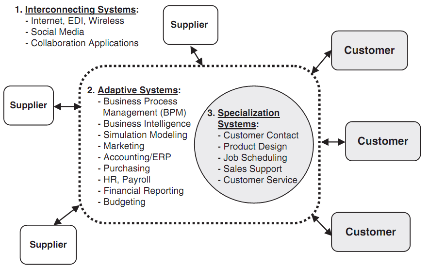

#### 목표
*   소프트웨어 바탕 경력 진로
*   IT 일반 상품화 (IT Commoditization)
*   소프트웨어 제품과 서비스 그리고 클라우드
   

### 클라우드 컴퓨팅의 핵심기술

[Salesforce.com](http://www.salesforce.com/)의 “No Software” 슬로건으로 SaaS 어플리케이션을 통해서 클라우드 컴퓨팅의 상업적인 시작의 초석이 되었지만, 다음 5가지 기술의 조합에 의해서 현재의 클라우드 컴퓨팅이 일반화 되었다.  

- **Software-as-a-Service (SaaS)**: 인터넷 활성화 및 인터넷을 일반사용자도 사용이 가능함에 따라 소프트웨어를 Site Licence나 팩키지 형태로 구매하여 설치하기보다 사용한 양에 따라 필요시마다 사용하는 것이 일반화되어 설치, 관리, 사용, 제거가 용이해졌고 저렴해졌다.  

- **서버가상화(Server Virtualization)**: 전통적인 컴퓨팅 환경에 비해 서버, 운영체계, 저장소, 네트워크 등을 가상화하여 Pool을 구성하여 하이퍼바이져(Hypbervisor)를 통해 다수 사용자가 사용하게 함으로써 컴퓨팅 자원의 효율성과 동시에 전문성을 확보함으로써 경제적인 면에서나 보안적인 측면에서 경쟁우위를 가져갈 수 있다.  

- **서비스 지향 아키텍쳐(Service-Oriented Architecture)**: 서비스지향 아키텍쳐 출현은 클라우드 컴퓨팅 환경하에서 소프트웨어 서비스 및 컴포넌트 개발의 속도를 가속했다. 여러 서비스나 제품에 재사용이 가능한 소프트웨어 및 컴포넌트는 마케터나 고객에게 클라우드 컴퓨팅환경하에서 새로운 서비스나 제품을 빠른시간 내에 높은 품질을 가지고 개발하여 제공할 수 있는 토대를 만들어냈다.  

- **공개 소프트웨어 (Open Software)**: 마이크로소프트가 성공적으로 소프트웨어를 비즈니스화한 배경에는 소프트웨어 저작권을 주장하여 사용권만 주고 개발을 독점함으로써 가능한 것으로 기술적으로 팩키지 소프트웨어 개발 및 소프트웨어 사용에 대한 댓가를 지불하는 라이센스 모델에 뿌리를 두고 있다. 하지만, 특정 그룹 및 업체에 소프트웨어 개발이 제한됨에 따라 발전에 한계가 있었으나, 공개소프트웨어 및 인터넷을 통한 협업 개발이 가능함에 따라 다양한 소프트웨어 개발이 클라우드 컴퓨팅의 핵심중의 하나로 자리잡게 되었다.  

- **OPEN API/Mashup**: API(Application Programming Interace)를 통한 웹 소프트웨어 개발은 웹사이트를 통한 사진공유 사이트나, 소셜네트워크 같은 정보의 이동과 공유를 가능하게 하였으며, 다양한 API를 통해서 Mashup 응용프로그램을 개발함으로써 다양한 서비스 개발이 빠른시간내에 가능하게 되었다.

### 클라우드 컴퓨팅 확산의 비즈니스 영향평가

지난 세기의 산업혁명은 규모의 경제를 통한 수익극대화를 이끌어내는 효율성 추구 사업모델을 만들어냈다면, 이번 세기는 지속적으로 변화하는 시장환경과 고객의 요구에 기민하고 민첩하게 반응하는 기업이 수익을 창출하는 시대가 되었다. 지난 세기의 사업모델은 고정비 투자를 통해 규모의 경제(economy of scale)를 이끌어내고 표준화된 제품에 고정비 투자를 여러해에 걸쳐서 상각시킴으로써 효율의 극대화를 통해서 경쟁우위에 서는 것이었다. 하지만, 제품의 수명주기가 점점 짧아지고, 고객의 요구사항이 다양해지고, 경쟁이 글로벌하게 이뤄지면서, 고객의 요구사항은 많아지고 점점더 세분화되는 니치마켓이 늘어나면서 자본을 대규모로 투자하여 상각하는 고정비 사업모델은 점점 설 자리를 잃고 있다.  

예를 들어, 모토롤라가 처음 대량생산을 통한 신뢰성 좋은 휴대전화를 만들어냈다. 하지만, 휴대전화 기술이 점점 일반 상품화되어가고, 새로운 경쟁자들이 생겨났다. 노키아는 휴대전화를 패션상품으로 경쟁자로 이름을 올리기 시작하였고, Research in Motion은 블랙베리를 통해서 전자우편과 핸드폰을 결합한 기업용 핸드폰 시장의 강자로 자리매김 하였으며, 애플은 컴퓨터와 핸드폰, 콘텐츠를 결합한 아이폰을 통하여 전혀 새로운 개념의 핸드폰을 만들었다. 이와 같이 변화가 많은 시장에서 위험을 최소화하는 방법은 클라우드 컴퓨팅을 활용하여 고정비를 변동비화하는 것이다. Diamond Management & Technology 컨설턴트는 이를 위한 7가지 전략을 크게 3가지로 다시 범주화하였다.  

- **목적에 부합하는 비용절감**: 모든 사람이 비용을 줄일 수는 있지만, 목적에 부합하는 비용을 절감할 수 있는 사람은 드물다. 생산성을 향상할 수 있고 회사 전체 운영비를 줄일 수 있는 부문에 집중한다.  

- **자동화, 자동화, 자동화**: 반복적이고 일상화된 일은 자동화를 통해서 운영의 효율성을 제고한다.  

- **전체비용 절감 및 변동비화할 수 있는 공급사 발굴**: 특정부분에 특화된 공급사를 발굴함으로써 규모의 경제를 통해서 비용을 절감하고, 전문성을 활용하여 업무의 효율을 높인다.  

- **신성장 고객발굴**: 전체 고객에 대한 제품 및 서비스를 제공하기보다 목적에 부합하고 장기적인 관계를 가져갈 수 있는 고객을 발굴한다.

- **마케팅 믹스 최적화**: 영업과 마케팅 노력을 회사의 제품과 서비스 가치를 가장 높일 수 있는 마케팅, 고객군에 집중한다. 특히 고객관계를 높일 수 있는 지속적인 실시간 소통방법을 찾아서 실행한다. 예를 들어 Facebook, Twitter, Youtube를 최소의 비용으로 활용한다.  

- **경쟁사가 투자하지 않는 미래에 투자**: 경쟁사가 하지 않는 분야의 제품과 서비스를 개발하는 곳에 투자한다.  

- **하나 혹은 몇개의 바구니에 모든 달걀을 담아라**: 수익성 높은 시장과 고객에 집중하여 핵심역량을 흐트리지 말고 하나 혹은 몇개의 사업영역에 집중하여 빠르게 바뀌는 시장상황에 집중한다.

위 7가지 실행전략은 3개의 범주로 크게 구분할 수 있다.

- **시스템연계 (Interconnecting Systems)**: Internet, EDI, 소셜 미디어 및 협업시스템
- **적응시스템 (Adaptive Systems)**: Business Process Management(BPM), Business Intelligence(BI), Simulation Modeling, ERP, Purchasing, HR/Payroll, Financial Reporting, Budgeting
- **전문시스템(Specialization Systems)**: 고객관리, 제품설계, Job Scheduling, 영업자동화, 고객서비스

> Hugos & Hulitzky 원문에 기반한 내용을 최대한 반영하면서 역자의 클라우드에 대한 사견을 반영하여 요약 번역하였다.  
> 출처: Hugos, M., & Hulitzky, D. (2011). Business in the Cloud: What every business needs to know about cloud computing. Vasa. John Wiley & Sons, Inc.
