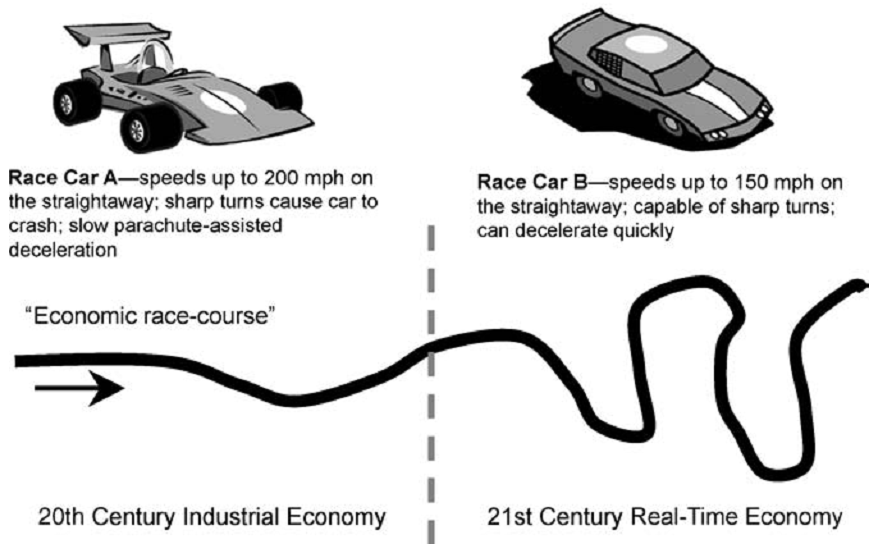
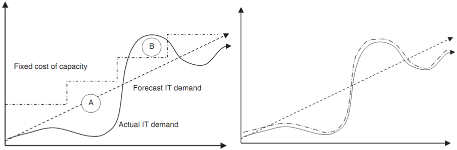

#### 목표
*  글로벌 분업화에 클라우드 기술의 대두 배경
*  글로벌 비즈니스 모델 
*  IT기술의 클라우드화
*  클라우드 전후 IT 비용 모델
   

### 글로벌 분업화에 클라우드 기술의 대두 배경  

반도체 및 소프트웨어의 성공적인 글로벌 분업화 모델 외에도 자유무역협정(FTA, Free Trade Agreement)의 확산으로 비즈니스적인 관점에서 글로벌 시장 개척을 통한 매출 증대와 더불어 경쟁력있는 인적 물적자원 활용 및 원가 경쟁력 강화를 위해서 많은 기업체들이 글로벌 사업모델에 비중을 높여가고 있다.  

글로벌화를 통한 신시장 개척과 경쟁력있는 인적 물적 자원을 효과적으로 활용하기 위해서는 기존의 메인플레임, 클라이언트-서버, 웹 인터넷을 넘어 클라우드의 활용이 기업들의 새로운 경쟁우위 요소로 대두되고 있다. 클라우드 기술은 기존의 닷컴버블 당시의 인터넷 기업들의 장점과 실패의 요소들을 보완하여 발전시킨 것으로 가상화(Virtualization), 범용 하드웨어(Commodity Hardware), 유틸리티 컴퓨팅(Utility Computing)의 종량제(Pay-as-you-go) 모델, 그리드 컴퓨팅(Grid Computing) 기술, SaaS 기술 등을 융합 접목시킨 것으로 기업들로 하여금 단순히 개발비용 절감 및 정보기술 운영비용 절감을 넘어 정보기술을 다른 국내 경쟁 기업뿐 아니라 글로벌 기업과도 차별화 할 수 있는 경쟁우위를 제공할 수 있는 새로운 전략을 제공하고 있다.  

### 글로벌 비즈니스 모델  

글로벌 비즈니스 모델은 경쟁우위를 위해서 하나의 국가 혹은 장소에서 연구개발, 생산, 판매, 관리(마케팅, 영업, 구매, 정보기술 등)를 수행하는 것에 비해서 글로벌하게 분산되어 있는 인적, 물적 자원들을 효율적으로 활용하여 기업의 경쟁우위를 가져가는 것을 목표로 하고 있다. 글로벌하게 분산되어 있는 인적, 물적 요소들을 하나의 장소에서 정보기술을 활용하는 것에 비교하여 특히 관심을 가져야 한다.  

특히, 지금까지 20세기 경쟁이 효율성의 경쟁이었다면, 이제부터 21세기의 경쟁은 민첩성/반응성이 중요한 경쟁의 요소로 되는 세계로 경쟁우위요소가 바뀌었다. 20세기는 예측가능한 사업환경으로 경쟁에서 승리하기 위해서 엄청난 속도를 갖는 다시 말해, 속도에 최적화된 스포츠 자동차가 유리하였다. 예측가능한 직선경주로가 20세기 사업환경에 비유될 수 있다. 하지만, 21세기는 불확실하고, 변화가 많은 사업환경으로 속도에 최적화된 스포츠 자동차로는 경쟁 우위를 가질 수가 없다. 상대적으로 속도에 최적화된 스프츠 자동차보다는 속도는 느리지만 경주로의 변화에 민첩하게 빠르게 반응할 수 있는 스포츠 자동차가 더 우위를 가질 수가 있다.

### IT기술의 클라우드화

IT기술의 클라우드화는 역사를 돌아보면 유사한 사례가 존재한다. 시카고에서 100년 전에 대형화재가 발생했다. 정확히 1871년 시카고 중심부를 잿더미로 만들고 텅빈 공간을 만들어 놓았으며, 역설적이게도 이것이 현재 대도시의 마천루를 만들어 새로운 건물이 들어설 수 있는 기반이 되었다.  

강철이 들어간 현대식 콘크리트 고층 건물이 시카고에 들어서고 전력은 지하실에 설치된 발전기를 통해서 조달되는 형태로 초기에는 운영이 되었다. 같은 시기에 Samuel Insull은 현재 우리가 전기를 사용하게 되는 모델(발전-송전-배전)을 차근차근 상업화시켜 나가고 있었다. 1910년 경부터 대형건물 소유자가 발전기를 통해 전기를 사용하는 것에 대해서, 발전기 설치비, 석탄 연료비, 운영인원에 대한 관리비용 및 효율성에 대한 의문을 재경/회계 담당자로부터 받기 시작한다. 1920년 경에는  발전기를 이용한 자가발전모델을 선택할 것이냐, 아니면 현재의 전기사용모델로 빌려쓸 것이냐를 심각하게 고려했다. 이럴 경우 보안이 우선이냐 생산성이 우선이냐의 문제로 귀결되며, 항상 승자는 생산성과 효율성이 특별한 경우를 제외하고는 승자가 되었다. 자가발전에 투입되던 회사 자원을 사업의 핵심역량에 재투자하여 기업 경쟁력을 유지하거나 높이는데 활용했다.  

동일한 역사가 전기에서 IT에서 일어나고 있으며, 이를 클라우드 컴퓨팅의 도래로 생각하고 있는 사람이 늘고 있다. Rubin 박사가 주도한 미국 산업 연구에 의하면 IT 예산의 변동비가 차지하는 부분이 30~35% 불과하고 많은 IT예산이 고정비에 투자되고 있으며, 회사의 가능한 자원을 사업의 핵심역량에 집중하고, 불확실성과 민첩성이 요구되는 사업환경에서 경쟁우위를 가져가기 위해서는 기존의 고정비를 변동비화할 필요가 있다고 주장했다.  

### 클라우드 전후 IT 비용 모델

현재까지 IT예산의 대부분은 IT설비구입 등 고정예산에 집중 투입되어 상대적으로 분석업무나 전략적인 부문에 투자가 되지 못하고 있다. 상대적으로 많은 IT예산을 고정예산 형태로 인프라구축 및 운영에 지출을 하고 있지만, 고정예산이 가지는 한계를 고스란히 가지게 되면서 기대했던 효과를 거두지는 못하고 있다. 지금과 같이 불확실성이 높은 사업환경하에서는 아무리 정교한 예측방법을 사용해도 IT예산을 고정예산화한 모형에서는 항상 IT인프라의 효율화 혹은 폭증하는 서비스에 대응을 하기 어렵다.  

상대적으로 IT예산 고정비용을 변동비용화할 경우 IT 투자비용을 최소로 가져갈 수 있으며, 서비스 운영비를 변동비화할 수 있고, 서비스 확장성을 기대할 수도 있다. 사업환경의 불확실성이 높아지고, 경쟁이 치열해지는 현재 사업환경에 IT비용을 변동비화하여 IT 고정비를 줄이면서도 사업 전개방향에 맞추어 IT 예산을 효율적으로 적시에 사용할 수 있다.  

IT예산을 고정비에서 변동비화한 클라우드 컴퓨팅은 다음의 세가지 특징이 있다.  

- **실질적으로 무한한 컴퓨팅 자원**: 프로세싱, 저장공간 및 응용소프트웨어에 대한 확장성이 높은 컴퓨팅 자원 이용 가능
- **단기 계약**: 컴퓨팅 자원의 즉시 사용성 및 장기 계약의 틀에 얽매이지 않는 재량 제공
- **종량제 비용 구조**: 초기 고정비가 없는만큼 사용한 컴퓨팅 자원에 맞추어 사용료를 지불  

> Hugos & Hulitzky 원문에 기반한 내용을 최대한 반영하면서 역자의 클라우드에 대한 사견을 반영하여 요약 번역하였다. 도표는 Weill와 Aral에서 가져왔다.
> 출처: Weill, P., & Aral, S. (2006). Generating premium returns on your IT investments. MIT Sloan management Review.  
> 출처: Hugos, M., & Hulitzky, D. (2011). Business in the Cloud: What every business needs to know about cloud computing. Vasa. John Wiley & Sons, Inc.
