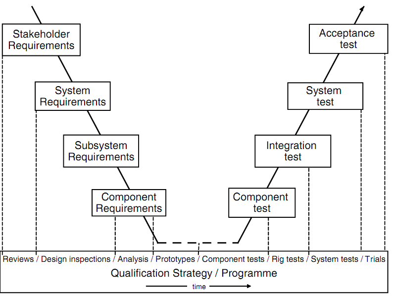

#### 목표
*  서비스/제품 요구공학 
*  클라우드 아키텍쳐
*  소프트웨어 개발 프로세스
   

### 서비스/제품 요구공학

#### 소프트웨어 제품/서비스 요구사항

클라우드에서 사용되는 요구사항분석 방법은 기존 고객의 요구사항을 받아서 작성하는 고객맞춤형 소프트웨어와 시장의 요구와 전략적인 부문을 고려하는 소프트웨어 제품의 요구사항과는 차이가 있다. 클라우드를 위한 요구사항에 대해서 어떻게 요구사항을 도출하고, 분석, 검증하여 최종적으로 작성하는 것에 대해서는 현재 연구진행 중이다. 하지만, 큰 범주에서 클라우드 소프트웨어는 소프트웨어라는 큰 범주에서 벗어나지 않기 때문에 일반적인 소프트웨어 요구사항을 작성하는 원칙과 방법을 적용하는 것은 큰 무리가 없어보인다.

#### 요구사항 분석 필요성

요구사항은 단순히 하나의 프로젝트나 제품의 소프트웨어나 서비스를 개발하기 위해서 필요한 것으로 생각하기보다, 최근에는 프로젝트나 제품간의 조직이나 팀원들간에 의사소통 도구로 중요한 역할을 하고 있다. 왜냐하면 최근의 많은 소프트웨어 조직들은 다음을 중요한 경쟁우위 요소로 생각하기 때문이다.

- 프로젝트나 제품간의 산출물 재사용 극대화
- 제품/서비스 공학을 위한 제품/서비스 관리
- 원활한 소프트웨어 개발 활동 지원
- 다른 프로젝트나 서비스의 경험 내재화를 위한 프로세스 최적화  

#### 요구사항 추적성

요구사항 추적성은 비즈니스의 상위 요구사항이 어떻게 하위 요구사항으로 연결되어 궁극적으로는 시스템에 반영되는지를 보여주는 연결고리이다. 비즈니스 요구사항이 사업의 비젼이 사업목적으로 해석되어 사업 조직과 프로세스로 실행되듯이, 소프트웨어 요구사항은 고객의 요구사항이 시스템 요구사항을 만족하고, 서브시스템으로 구분되고 컴포넌트나 서비스로 실행된다. 요구사항의 추적성은 다음과 같은 장점을 제공한다.

- 소프트웨어 제품/서비스의 충족성
- 변경사항에 대한 영향분석의 용이성
- 권한과 책임에 대한 명확한 구분
- 소프트웨어 제품/서비스 진도관리 및 투명성
- 요구사항 개발에 대한 효과 대비 비용 추정  

#### 요구사항 분석 절차

고객으로부터 요구사항이 글자와 그림으로 표현된 문서로부터 출발하여 시스템 요구사항서, 서브시스템 요구사항서, 컴포넌트 요구사항서로 표현되어 전달이 되고, 각각의 시스템 수준에 맞추어 고객의 요구사항이 제대로 반영되어 제품이나 서비스에 반영되었는지는 승인테스트(Acceptance Test), 시스템 요구사항은 시스템테스트(System Test), 서브시스템 요구사항은 통합테스트(Integration Test), 컴포넌트 요구사항은 컴포넌트 테스트(Component Test)를 통해서 검증작업이 수행되고 이의 결과값은 다시 고객으로 전달되는 과정을 거치게 된다.

#### 요구사항 검증

고객의 요구사항이 시스템 요구사항, 서브시스템 요구사항, 컴포넌트 요구사항으로 전달되어 역순으로 개발이 진행되고 진행된 결과가 제대로 반영이 되어 진행이 되는지에 대해서는 단순히 테스트 전략만을 통해서 소프트웨어 서비스/제품의 완성도가 결정되는 것이 아니라 다양한 검증활동이 각각의 소프트웨어 서비스/제품 개발단계에서 수행된다.  

요구사항 V-Model 검증전략에는 고객의 요구사항 단계에서 리뷰를 승인테스트(Acceptance Test)가 최종진행되기 이전에 시스템 요구사항으로 전달되기 전에 검증작업을 진행하며, 동일하게 시스템/서브시스템 요구사항도 디자인 인스펙션(Design Inspection)을 통해서 검증작업을 진행하며, 컴포넌트 요구사항단계에서는 분석을 수행한 후 프로토타입을 개발하여 검증작업을 추가로 진행하고 이를 최종 양산을 위한 서비스 제품개발을 위해서 컴포넌트 단위, 통합, 시스템, 최종 필드 테스트까지 진행을 하게된다.  

요구사항을 고객요구단계에서 Problem 도메인 고객의 관점에서 소프트웨어 서비스/제품의 원하는 것(What)을 정확히 기술하고, 시스템 요구사항 단계에서는 고객의 요구사항을 시스템에 어떻게(How) 담을 것인지를 분석가 관점에서 기술하고, 아키텍쳐 설계 단계에서 설계자 관점에서 각각의 아키텍쳐 설계가 시스템 요구사항을 어떻게(How) 만족해야 하는지를 작성한다.  

    <table class="table table-striped">
      <tr> <td>요구사항 단계</td> <td>도메인(Domain)</td> <td>뷰(View)</td> <td>역할</td> </tr>
      <tr> <td>고객 요구사항</td> <td>Problem 도메인</td> <td>고객 뷰</td> <td>소프트웨어 서비스/제품을 통해서 고객이 원하는 것(How)을 작성</td> </tr>
      <tr> <td>시스템 요구사항</td> <td>Solution 도메인</td> <td>분석자 뷰</td> <td>고객의 요구사항을 만족하기 위해서 어떻게 소프트웨어 시스템/제품이 작동(How)되어야 하는지 작성</td> </tr>
      <tr> <td>아키텍쳐 설계</td> <td>Solution 도메인</td> <td>설계자 뷰</td> <td>각각의 아키텍쳐 설계가 시스템 요구사항을 어떻게 만족(How)해야 하는지를 작성</td> </tr>
    </table>  

이와 같이 요구사항을 문제도메인(Problem Domain)과 해결책도메인(Solution Domain)으로 구분하는 것은 상대적으로 다음의 문제점을 보완하는데 도움을 준다.  

- 실제문제에 대한 정확한 이해
- 시스템의 범위 설정과 시스템을 구성하는 각 기능의 정확한 이해
- 설계 자유도의 부족으로 인한 최적의 해결책 탐색
- 해결책 중심 시스템 설명은 개발자 및 솔류션 제공업체 위주의 개발에서 탈피

> E Hull, K Jackson, J Dick 원문에 기반한 내용을 최대한 반영하면서 역자의 클라우드에 대한 사견을 반영하여 요약 번역하였다. 도표는 Weill와 Aral에서 가져왔다.
> 출처: Elizabeth Hull, Ken Jackson, and Jeremy Dick. Requirements engineering. Springer, 2011.
