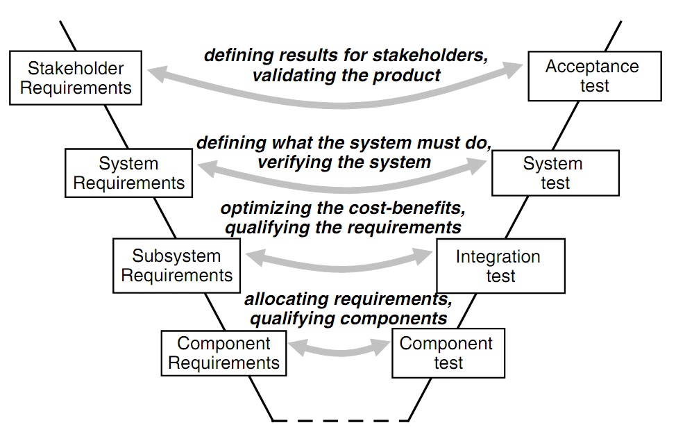
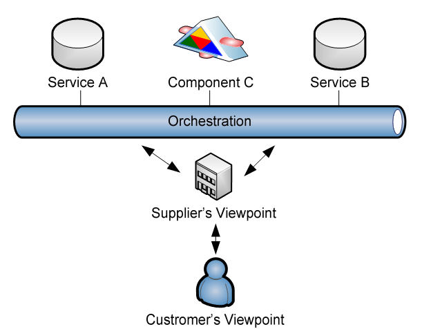
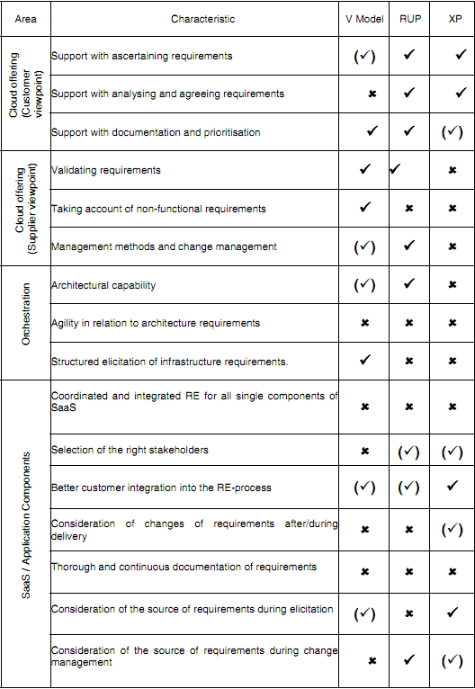
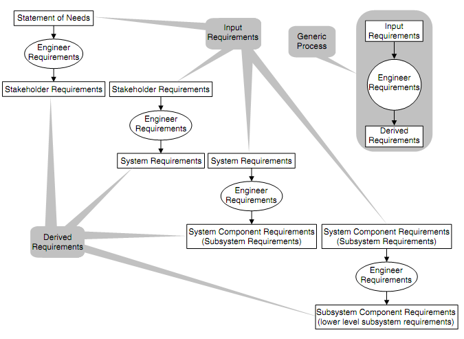
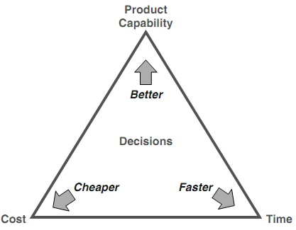
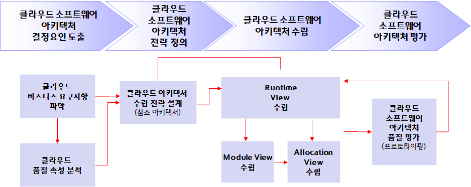

#### 목표
*  서비스/제품 요구공학 
*  클라우드 요구공학
*  클라우드 서비스/제품 아키텍쳐
*  소프트웨어 개발 프로세스
   

### 서비스/제품 요구공학

#### 소프트웨어 제품/서비스 요구사항

클라우드에서 사용되는 요구사항분석 방법은 기존 고객의 요구사항을 받아서 작성하는 고객맞춤형 소프트웨어와 시장의 요구와 전략적인 부문을 고려하는 소프트웨어 제품의 요구사항과는 차이가 있다. 클라우드를 위한 요구사항에 대해서 어떻게 요구사항을 도출하고, 분석, 검증하여 최종적으로 작성하는 것에 대해서는 현재 연구진행 중이다. 하지만, 큰 범주에서 클라우드 소프트웨어는 소프트웨어라는 큰 범주에서 벗어나지 않기 때문에 일반적인 소프트웨어 요구사항을 작성하는 원칙과 방법을 적용하는 것은 큰 무리가 없어보인다.

#### 요구사항 분석 필요성

요구사항은 단순히 하나의 프로젝트나 제품의 소프트웨어나 서비스를 개발하기 위해서 필요한 것으로 생각하기보다, 최근에는 프로젝트나 제품간의 조직이나 팀원들간에 의사소통 도구로 중요한 역할을 하고 있다. 왜냐하면 최근의 많은 소프트웨어 조직들은 다음을 중요한 경쟁우위 요소로 생각하기 때문이다.

- 프로젝트나 제품간의 산출물 재사용 극대화
- 제품/서비스 공학을 위한 제품/서비스 관리
- 원활한 소프트웨어 개발 활동 지원
- 다른 프로젝트나 서비스의 경험 내재화를 위한 프로세스 최적화  

#### 요구사항 추적성

요구사항 추적성은 비즈니스의 상위 요구사항이 어떻게 하위 요구사항으로 연결되어 궁극적으로는 시스템에 반영되는지를 보여주는 연결고리이다. 비즈니스 요구사항이 사업의 비젼이 사업목적으로 해석되어 사업 조직과 프로세스로 실행되듯이, 소프트웨어 요구사항은 고객의 요구사항이 시스템 요구사항을 만족하고, 서브시스템으로 구분되고 컴포넌트나 서비스로 실행된다. 요구사항의 추적성은 다음과 같은 장점을 제공한다.

- 소프트웨어 제품/서비스의 충족성
- 변경사항에 대한 영향분석의 용이성
- 권한과 책임에 대한 명확한 구분
- 소프트웨어 제품/서비스 진도관리 및 투명성
- 요구사항 개발에 대한 효과 대비 비용 추정  

#### 요구사항 분석 절차

고객으로부터 요구사항이 글자와 그림으로 표현된 문서로부터 출발하여 시스템 요구사항서, 서브시스템 요구사항서, 컴포넌트 요구사항서로 표현되어 전달이 되고, 각각의 시스템 수준에 맞추어 고객의 요구사항이 제대로 반영되어 제품이나 서비스에 반영되었는지는 승인테스트(Acceptance Test), 시스템 요구사항은 시스템테스트(System Test), 서브시스템 요구사항은 통합테스트(Integration Test), 컴포넌트 요구사항은 컴포넌트 테스트(Component Test)를 통해서 검증작업이 수행되고 이의 결과값은 다시 고객으로 전달되는 과정을 거치게 된다.

#### 요구사항 검증

고객의 요구사항이 시스템 요구사항, 서브시스템 요구사항, 컴포넌트 요구사항으로 전달되어 역순으로 개발이 진행되고 진행된 결과가 제대로 반영이 되어 진행이 되는지에 대해서는 단순히 테스트 전략만을 통해서 소프트웨어 서비스/제품의 완성도가 결정되는 것이 아니라 다양한 검증활동이 각각의 소프트웨어 서비스/제품 개발단계에서 수행된다.  

요구사항 V-Model 검증전략에는 고객의 요구사항 단계에서 리뷰를 승인테스트(Acceptance Test)가 최종진행되기 이전에 시스템 요구사항으로 전달되기 전에 검증작업을 진행하며, 동일하게 시스템/서브시스템 요구사항도 디자인 인스펙션(Design Inspection)을 통해서 검증작업을 진행하며, 컴포넌트 요구사항단계에서는 분석을 수행한 후 프로토타입을 개발하여 검증작업을 추가로 진행하고 이를 최종 양산을 위한 서비스 제품개발을 위해서 컴포넌트 단위, 통합, 시스템, 최종 필드 테스트까지 진행을 하게된다.  

요구사항을 고객요구단계에서 Problem 도메인 고객의 관점에서 소프트웨어 서비스/제품의 원하는 것(What)을 정확히 기술하고, 시스템 요구사항 단계에서는 고객의 요구사항을 시스템에 어떻게(How) 담을 것인지를 분석가 관점에서 기술하고, 아키텍쳐 설계 단계에서 설계자 관점에서 각각의 아키텍쳐 설계가 시스템 요구사항을 어떻게(How) 만족해야 하는지를 작성한다.  

<table class="table table-striped">
   <tr> <td>요구사항 단계</td> <td>도메인(Domain)</td> <td>뷰(View)</td> <td>역할</td> </tr>
   <tr> <td>고객 요구사항</td> <td>Problem 도메인</td> <td>고객 뷰</td> <td>소프트웨어 서비스/제품을 통해서 고객이 원하는 것(How)을 작성</td> </tr>
   <tr> <td>시스템 요구사항</td> <td>Solution 도메인</td> <td>분석자 뷰</td> <td>고객의 요구사항을 만족하기 위해서 어떻게 소프트웨어 시스템/제품이 작동(How)되어야 하는지 작성</td> </tr>
   <tr> <td>아키텍쳐 설계</td> <td>Solution 도메인</td> <td>설계자 뷰</td> <td>각각의 아키텍쳐 설계가 시스템 요구사항을 어떻게 만족(How)해야 하는지를 작성</td> </tr>
</table>  

이와 같이 요구사항을 문제도메인(Problem Domain)과 해결책도메인(Solution Domain)으로 구분하는 것은 상대적으로 다음의 문제점을 보완하는데 도움을 준다.  

- 실제문제에 대한 정확한 이해
- 시스템의 범위 설정과 시스템을 구성하는 각 기능의 정확한 이해
- 설계 자유도의 부족으로 인한 최적의 해결책 탐색
- 해결책 중심 시스템 설명은 개발자 및 솔류션 제공업체 위주의 개발에서 탈피

> E Hull, K Jackson, J Dick 원문에 기반한 내용을 최대한 반영하면서 역자의 클라우드에 대한 사견을 반영하여 요약 번역하였다.
> 출처: Elizabeth Hull, Ken Jackson, and Jeremy Dick. Requirements engineering. Springer, 2011.

### 클라우드 요구공학

#### 클라우드 소프트웨어 서비스/제품 위한 요구공학(Requirement Engineering)

클라우드 시스템은 오케스트레이션을 통한 다양한 서비스와 컴포넌트를 Cloud Service Brokerage 공급사를 통해서 고객에게 전달되는 소프트웨어로 볼 수 있다. 이와 같은 클라우드 소프트웨어 서비스/제품을 개발하기 위해서 요구사항 관리가 필수적이다.

- 고객의 관점에서 클라우드 서비스 제공을 요구사항 반영
- 개발사 관점에서 클라우드 서비스 제공을 요구사항 반영
- 클라우드 서비스 오케스트레이션
- SaaS 클라우드 서비스 연계

클라우드 서비스를 요구공학(Requirement Engineering) 위 4가지 관점을 소프트웨어 서비스/개발 관점에서 많이 사용되고 있는 V-Model, RUP, XP 개발 방법론과 비교가능하지만, 현재까지 클라우드 서비스를 완벽하게 지원하는 요구공학 개발 방법론은 존재하고 있지 않다. 다만, 각각의 요구공학 방법론을 클라우드 서비스에 적용할 경우 비교를 통해서 최선의 요구공학 방법론의 도출 및 적용점을 발견하는 것은 상대적으로 그렇지 못한 경우에 비교해서 고객의 요구사항을 클라우드 서비스 개발에 반영하여 기업에서 원하는 결과를 얻는데 도움이 많이 될 것으로 기대된다.  

- 고객의 관점에서 클라우드 서비스 제공을 요구사항 반영: 고객관점의 클라우드 서비스를 위한 요구사항은 고객이 원하는 요구사항 도출, 요구사항 분석 및 요구사항 승인, 형식요건을 갖춘 요구사양서 작성  
- 개발사 관점에서 클라우드 서비스 제공을 요구사항 반영: 개발사 관점에서는 요구사항의 검증, 비기능 요구사항의 만족(고객만족, 법적이슈 등), 변경 요구사항 관리  
- 클라우드 서비스 오케스트레이션: 요구공학을 통한 아키텍쳐 성능, 요구공학을 통한 민첩성(Agility), 특히 클라우드 서비스의 컴포넌트 아키텍쳐는 재사용성, 대체성, 확장성 등에 용이  
- SaaS 클라우드 서비스 연계: 다양한 서비스 및 컴포넌트 통합관리 요구공학, 개발 후의 검증 및 추적관리 지원  

가장 많이 사용되는 소프트웨어 서비스/제품 개발방법론인 V-Model, RUP, XP는 태생적인 한계로 인하여 고객/개발/클라우드 환경/SaaS 클라우드 서비스 관점에서 요구공학의 지원에 한계를 가지고 있다. V-Model은 특정 고객의 요구사항을 수용하여 개발하는 주문형 소프트웨어(Custom Software) 개발 목적으로 개발되어 특히, 클라우드 서비스/제품에서 중요한 요소인 민첩성(Agility)을 요구공학 반영에 한계를 가진다. RUP도 마찬가지 한계를 가지고 있지만 특히, SaaS형 클라우드 서비스/제품 개발을 최적 지원하지는 못한다. XP는 상대적으로 RUP에 비해서 On-Site Customer Pracitce등을 통해서 클라우드 서비스/제품 개발에 도움을 많이 주는 것은 사실이나, 요구사항의 검증 및 요구사항 변경관리에는 상대적 한계를 지니며, 특히, 클라우드 서비스/제품 개발완료 후에는 한계를 보인다.  

> 출처: Wind, S., Schrödl, H. (2011). Requirements engineering for cloud 
> computing: a comparison framework. Web Information Systems Engineering–
> WISE 2010 …. 
> Retrieved from http://link.springer.com/chapter/10.1007/978-3-642-24396-7_32

#### 요구명세서 작성

요구명세서는 3가지 필수 항목을 가지고, 소프트웨어 서비스/제품에 대한 필요 사양에 대한 수준별 추적성 5가지를 고려하여 요구명세서를 작성한다. 요구명세서를 작성함에 있어서 요구사항은 다음 3가지 항목을 필수적으로 가져야 한다.  

- 승인(Agreeement)
- 검증(Qualification)
- 충족(Satisfaction)  

추가로 요구명세서는 다음의 5가지 수준의 요구명세가 추적가능하도록 작성되어야 한다.  

- 소프트웨어 시스템/서비스 필요 명세서 (Needs Statement)
- 고객 요구명세서 (Customer Requirements)
- 시스템 요구명세서 (System Requirements)
- 서브시스템 요구명세서 (Subsystem Requirements)
- 컴포넌트 요구명세서(Components Requirements)  

요구명세서는 소프트웨어 서비스/제품 필요명세서가 입력 요구명세서가 되고 요구명세 공학을 통해서 고객요구명세서 산출물로 도출되고, 이 고객요구명세서는 다시 시스템 요구명세서 산출을 위한 입력 요구명세서가 된다. 시스템 요구명세서는 서브시스템요구명세서 산출을 위한 입력 요구명세서가 되며, 마지막으로 서브시스템 요구명세서는 컴포넌트 요구명세서 산출을 위한 입력 요구명세서가 된다.  

소프트웨어 서비스/제품 개발을 위한 각 단계별 입력 요구명세서는 각 소프트웨어개발 단계별 검증전략에 맞추어 승인 단계를 거쳐야한다. 각 단계별 요구명세서의 분석 및 모델을 통한 분석은 다음 단계의 입력 요구명세서 산출을 위해 필요하다. 각 단계별 산출 요구명세서는 산출 요구명세서 검증전략의 검증 절차에 따라 승인의 단계를 거처 다음 단계로 나아가게 된다. 요구명세작성의 일반 프로세스는 다음과 같다. 

#### 클라우드에서의 요구사양 관리

거의 모든 소프트웨어 서비스/제품 개발은 제품/서비스 성능/기능, 개발 비용 및 시장적시성(Time-to-Market)의 제약조건을 충족하여야 한다. 특히, 클라우드 환경하에서 소프트웨어 서비스/제품 개발은 상대적으로 다른 소프트웨어 서비스/제품 개발과 비교하여 시장/고객에서 요구하는 성능/기능을 최대한 빠른 시간 내 빠르게 저렴한 가격으로 개발을 하여야만 클라우드 서비스/제품의 경쟁력을 유지할 수 있다.  

잘 작성된 요구사항은 소프트웨어 서비스/제품의 성능/기능의 필요요구에서부터 컴포넌트 요구명세까지 주어진 예산내에서 관리 가능한 품질수준의 서비스/제품을 시장의 적시성에 맞추어 고객에게 전달될 때 다양하고 경쟁력있는 글로벌 서비스/제품이 난무하는 환경에서 지속적으로 고객에게 사랑받을 수 있는 소프트웨어 제품/서비스를 공급할 수 있다. 개발비용(Cost), 시장적시성(Time-to-Market), 제품/서비스 성능 삼각 구도는 다음과 같다.

 > 출처: Hull, Elizabeth, Ken Jackson, and Jeremy Dick. Requirements engineering. Springer, 2011.

###  클라우드 서비스/제품 아키텍쳐

**소프트웨어 아키텍처**는 소프트웨어 시스템에 요구되는 기능과 품질을 갖고, 또한 소프트웨어 시스템을 용이하게 구축하고 지속적인 운용과 개선을 위하여 필요한 진화성을 갖도록 하는 소프트웨어 시스템 구조 및 개발 전 공정에 대한 중요한 결정들이다. 특히, 소프트웨어 개발의 출발점이 사용자/시장 요구사항이다. 전체 요구사항이 소프트웨어 개발의 대상이 되지만, 아키텍처에 관련된 대표적인 요구사항만이 주된 관심사항이 되는 것은 차이점이 되며, 이러한 특별한 요구사항들을 아키텍처 드라이버라고 하며 이를 통해서 아키텍처를 설계하게 되면 아키텍처 문서와 아키텍처 가이드라인이 이차적인 산출물이 된다. 클라우드 소프트웨어 아키텍쳐를 구축하기 위해서는 다음의 단계를 통해서 클라우드 소프트웨어 아키텍쳐를 구축한다.

- 클라우드 소프트웨어 아케텍쳐 결정요인 도출
- 클라우드 소프트웨어 아키텍쳐 전략 정의
- 클라우드 소프트웨어 아키텍쳐 수립
- 클라우드 소프트웨어 아키텍쳐 평가

클라우드 소프트웨어 제품과 서비스 개발을 위한 아키텍처를 만들기 위해서는 우선 클라우드 소프트웨어 아키텍처의 주요 결정요인을 도출하여야 한다. 시장조사보고서, 개발계획서, 사업분석 및 목표, 사용자 요구사항(UseCase), 제약사항등을 이해관계자와 Context Diagram 등 시각적 도움자료(Visual Aids)를 가지고 소통과 협력을 해야하며, 제약 사항도 함께 검토를 하여 클라우드 소프트웨어 제품/서비스의 주요 품질 속성을 분석한다.  

클라우드 아키텍처 스타일 및 클라우드 참조 아키텍처를 통해서 클라우드 소프트웨어 제품/서비스 아키텍처 수립 전략을 정의한다. 특히, 이해관계자와 Context Diagram, 제약사항, 품질속성 시나리오등을 통해서 클라우드 소프트웨어 아키텍처 수립을 위한 사전 준비를 한다.  

분할정복원리(Divide-and-Conquer) 등 설계일반원리, 아키텍처 패턴, 품질속성 내재화 전략 및 Runtime View, Module View, Allocation View를 통해서 아키텍처를 수립한다. 아키텍처 정의서 및 참조 아키텍처(Architecture Asset), 대안 아키텍처 평가서를 통해서 아키텍처 검토(Review)와 아키텍처 평가를 완료한 후 최종 아키텍처를 확정하여 상세설계로 넘어간다.  

> 문헌: 강성원 (2012), “소프트웨어 아키텍처로의 초대”, 홍릉과학출판사

### 소프트웨어 개발 프로세스

소프트웨어 개발하면 사람들은 Agile, RUP, Waterfall 등등… 다양한 개발 방법론을 떠올린다. 처음 소프트웨어 개발방법론을 얘기하면 그 각론으로 들어가서 사람들의 생각을 멈추게하는 부작용도 있다. 따라서 소프트웨어 개발방법론에 대해서 실무에 적용하는 진지한 고민은 다양한 소프트웨어 개발방법론을 적용하면서 실패를 뼈져리게 느끼게 된 이후가 많다.  

사실 소프트웨어 개발방법론의 필요성이 생겨난지도 그리 오래된 것은 아니다. IBM/360 메인프레임에 O/S를 개발하면서 엄청나게 많은 돈과 인력을 소프트웨어 개발에 투입되었지만, 성과가 나지 않자 왜? 라는 의문을 가지게 되고 … 이를 경험으로 IBM의 전설적인 “Mythical Manmonth” 저자인 브룩스 같은 사람들이 IBM에서의 경험을 학계 및 산업계에 전파하면서 성공사례로 알려지게 되었다.  

하지만, 이것은 너무도 많은 부작용을 만들어 낸 것도 사실이다. 대표적인 부작용이 모든 소프트웨어는 IBM의 개발방법론 폭포수(Waterfall) 및 엄격한 품질관리에 기초한 소프트웨어 개발이다. 그렇다고 IBM이 전적으로 폭포수 개발방법론만 실했다는 것은 사실이 아니며 최근의 스크럼(scrum)으로 대표되는 애자일의 장점을 충분히 활용했다는 것도 주지의 사실이다. 기존 개발방법론에 대한 반성과 다른 개발방법론이 있다는 것이 알려진 것이 마이크로소프트로부터다. 마이크로소프트는 IBM PC의 DOS 운영체제의 차세대 소프트웨어를 공동개발하면서 IBM의 연구진으로부터 IBM의 개발방법론을 기반으로 O/S를 개발하였다. 하지만, 메인프레임에 성공적으로 적용된 개발방법론은 PC 시장에서는 성공할 수 없는 개발방법론이었다. 마이크로소프트의 성공 비결을 여러가지를 꼽고 있지만, 그중에 가장 큰 것이 많은 사람들은 다른 회사의 DOS 시스템을 IBM에 어머니의 도움으로 성공적으로 판매를 연결하여 이를 바탕으로 독점구조를 인텔과 함께 이루어낸 것으로 알려져 있다.  

사실 마이크로소프트가 “Synch-and-Stabilize” 라는  Incremental and Iterative development의 개념을 성공적으로 적용하여 다수 Microsoft 제품을 만들어 낸 것이 Microsoft를 대표적인 글로벌 소프트웨어 기업으로 우뚝설 수 있게 한 크나큰 요인으로 볼 수 있다. 마이크로소프트의 개발방법론 “Synch-and-Stabilize”는 IBM과의 결별 후에 넷스케이프와 웹브라우져 전쟁에서의 승리, GUI 없이 설계진행된 O/S를 변경하여 개인용 O/S에서 기업용 O/S (Windows NT) 시장으로 성공적으로 진행된 사례를 볼 수 있다.  

이제 클라우드 시대가 왔다. 마이크로소프트의 “Synch-and-Stabilize” 개발방법론도 클라우드 시대에 적합한 것인지 검토가 필요한 시기가 왔다. 아직까지 마이크로소프트가 Azure를 통해서 클라우드 시대에서도 위대한 회사의 역할을 이어가고자 하지만, 다른 경쟁자인 구글, 아마존 등 소프트웨어를 주요 경쟁요소로 생각하고 있는 업체가 마이크로소프트 보다도 더 좋은 성과를 지금까지 보여주고 있다. 그렇다고 IBM이 사라져가는 것은 아니며, 그들만의 영역을 확고히 하면서 여전히 소프트웨어 개발에서 중요한 위치를 가져가고 있다.  

클라우드는 서비스(Service)의 요소를 많이 담고 있다. SI로 대표되는 주문형 소프트웨어(Custom Software) 개발하는 개발방법론과 마이크로소프트로 대표되는 소프트웨어 제품(Software Product)의 개발방법론은 서로 다르며 나름대로 성공적인 개발방법론을 변화하는 환경에 맞추어서 진화하고 있다. 클라우드 소프트웨어를 개발함에 있어서 개발방법론은 기존의 성공사례를 반추하고, 클라우드라는 새로운 사업환경에 맞추어 나름대로의 성공적인 개발방법론을 구축한 회사는 향후 클라우드 시대를 주도적으로 나아가는데 크나큰 도움이 될 것은 명확하다.  

